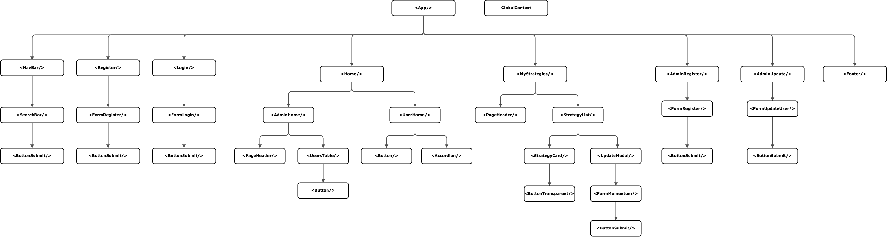

# Frontend Development for AlgoBeez

This is the frontend development for AlgoBeez, an algorithmic trading backtesting application.


## Installation

1. Clone the repository: git clone https://github.com/chen-shujun23/Algotrading-Backtesting-Frontend
2. Install dependencies:

- Create a Vite project
- npm install
- npm i @alpacahq/alpaca-trade-api dayjs jsonwebtoken react react-dom react-icons react-router-dom recharts
- npm install -D tailwindcss autoprefixer postcss tailwindcss vite-plugin-node-polyfills

3. Start the development server: npm run dev
4. Open http://localhost:3000 or any other port that you have configured to view it in the browser.
5. Create a config file with the following configuration:

```javascript
const config = {
  APCA_BASE_URL: "https://data.alpaca.markets/v2",
  APCA_API_KEY: "yourAlpacaAPIKey",
  APCA_API_SECRET: "yourAlpacaAPISecret",
  BASE_URL: "http://127.0.0.1:5001",
};
```

## Usage

This repository should run concurrently with the backend server to retrieve data from the database and store user inputs in the database. You may clone the backend development repository from https://github.com/chen-shujun23/Algotrading-Backtesting-Backend

## Technologies

This project uses the following technologies:

- HTML, CSS, Javascript
- TailwindCSS: a utility-first CSS framework
- **P**ostgresSQL: a SQL database used to store and retrieve data
- **E**xpress: a backend web framework for Node.js
- **R**eact: a frontend JavaScript library for building user interfaces
- **N**ode.js: a JavaScript runtime environment for server-side development

## Hierarchy



## Frontend Approach

This project uses Alpaca API for historical stock data. The Axios library is used to fetch user and strategy data from the backend server and the backend data is analyzed against the Alpaca historical data on the frontend to show the profit/loss on the user interface. A useAlpaca custom hook is created:

```javascript
const useAlpaca = () => {
  const [apcaData, setData] = useState([]);
  const [error, setError] = useState(null);
  const [loading, setLoading] = useState(false);

  //Instantiate the Alpaca class and define the parameters that go along with it
  const alpaca = new Alpaca({
    keyId: config.APCA_API_KEY,
    secretKey: config.APCA_API_SECRET,
    paper: true,
  });

  const fetchBars = async (symbol, start_date, end_date) => {
    try {
      setLoading(true);
      const stream = alpaca.getBarsV2(symbol, {
        start: start_date,
        end: end_date,
        timeframe: "1D",
        limit: dayjs(end_date).diff(dayjs(start_date), "day"),
      });
      let bars = [];
      for await (let bar of stream) {
        bars.push(bar);
      }
      setData(bars);
    } catch (error) {
      setError(error);
    } finally {
      setLoading(false);
    }
  };

  return [apcaData, error, loading, fetchBars];
};
```

A useAxios hook is also created to allow for easy fetching wherever the data is required.

```javascript
  const fetchData = async (URL, METHOD, BODY, TOKEN = null) => {
    setLoading(true);
    try {
      const response = await axios({
        method: METHOD,
        url: URL,
        headers: {
          "Content-Type": "application/json",
          Authorization: "Bearer " + TOKEN,
        },
        data: BODY,
      });
      setData(response.data);
      setLoading(false);
    } catch (error) {
      setError(error);
      console.log(error.response.data.message);
      setLoading(false);
    }
  };

  return [data, loading, error, fetchData];
};
```

The access token in stored using the createContext hook withing the App component so that it can be retrieved for authorisation in other components, using the useContext hook.

## Unsolved Problems & Further Work

- Include more form types for different types of trading strategies
- Complete Discover and Search Results page

## References

- All images are downloaded from [Canva](https://www.canva.com/).

```

```
